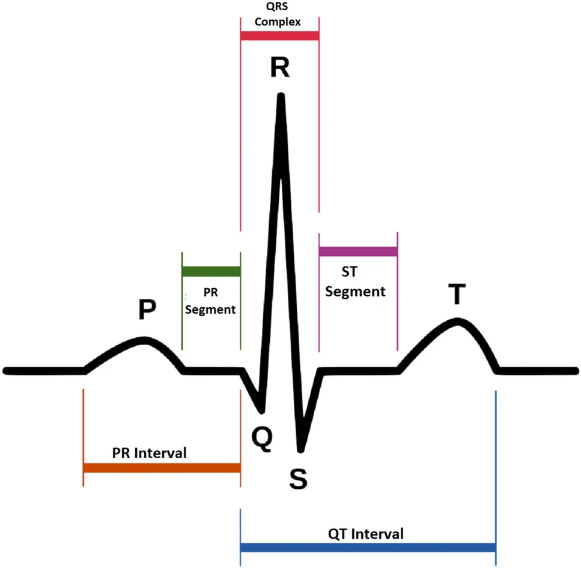
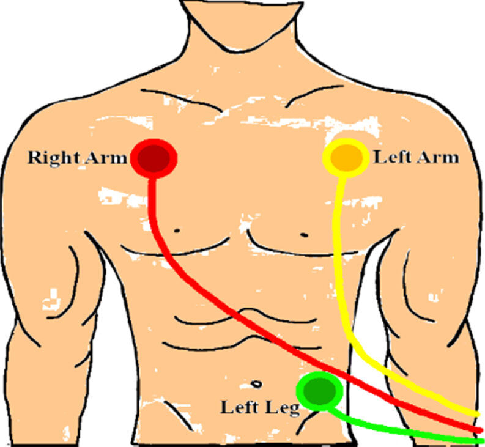
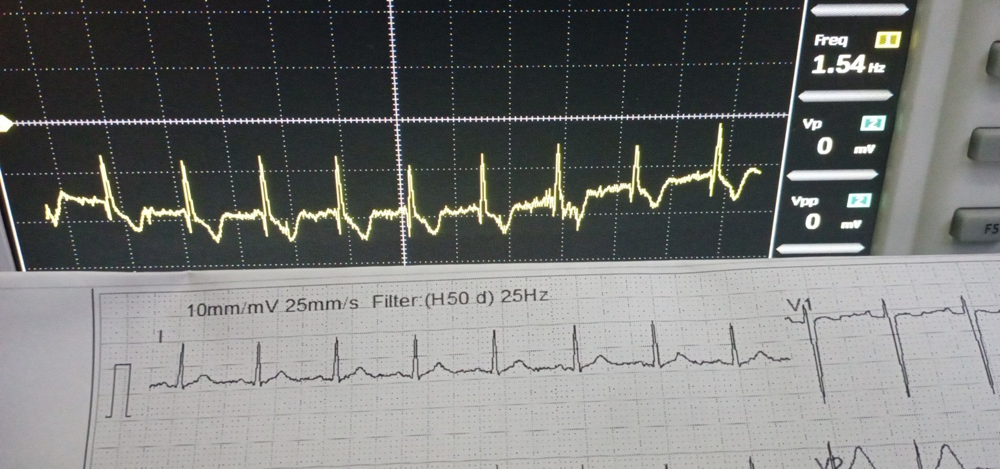
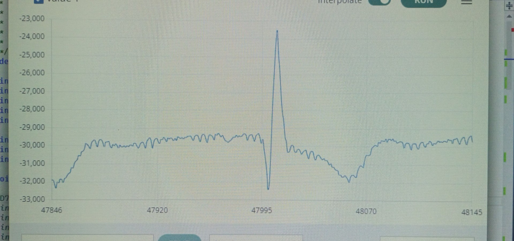

# ECG MEASUREMENT CIRCUIT

*This project is a part of Project I course in curriculum.*

The target of this project is deal with biosignal include reading from sensors, filtering and digitalizing it. 

## About ECG

Electrocardiogram (ECG) signals represent the electrical activity of the human hearts and consist of several waveforms (P, QRS, and T). The duration and shape of each waveform and the distances between different peaks are used to diagnose heart diseases.

  

## Feature

This circuit is used as a ECG sensor with AD74115 chip (SPI interface). It's comfortable for analyzing the ECG signal.

## How to use

  

## Result

  The ECC signal at the input of AD74115.

  

  The ECC signal after converting and plotting on GUI.

  

s